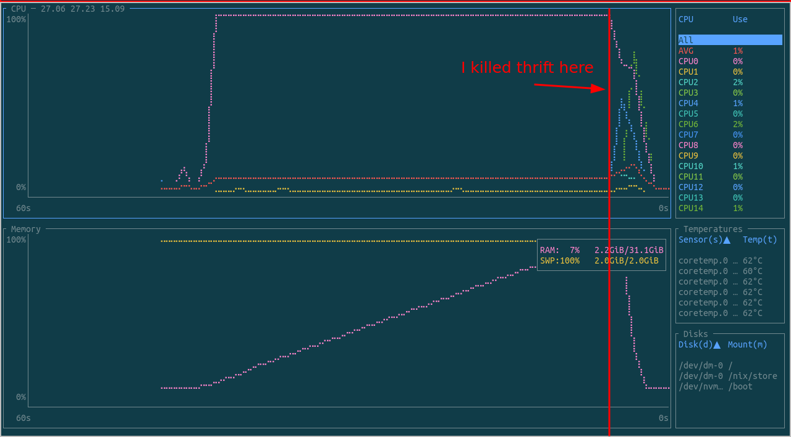

Repro of some bizarre behavior of the thrift compiler (reproducible on thrift 0.18.1).

_Note: I reported this bug upstream here: https://issues.apache.org/jira/browse/THRIFT-5733, and it was quickly fixed in https://github.com/apache/thrift/pull/2851/. I'm not sure which version of Thrift will include the fix._

Dangerous command to run (either runs forever, or just consumes a ton of ram before segfaulting):

    $ thrift --version
    Thrift version 0.18.1
    $ make repro ENUM_VALUE_COUNT=2000

Here's a graph of CPU and RAM on my machine while running the above command:

